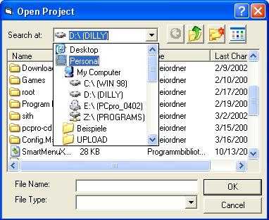



## Common DLG

### Description

This Common Dialog replaces Microsoft's Common Dialog as using that would just add one more dependancy to your project, where VB already has more than enough of that! Though it is by no means already completed as it doesn't already got colour or font picking abilities, nor does it have a print dialog. It's also not as easy as with the MS Commondialog to use this in your apps. I'll continue on this though as it'd be really great to slowly replace all of that dumb control packages (where you only need one control but got to include the whole file) with single controls, that can be used as usercontrols, not as ocx's which is by my opinion much better as you don't have to take care about the registering and stuff... I dont really trust the setup anymore.
 
### More Info
 
Just put it on a form and use it as a normal commondialog

Has to be placed on a Form, instead of being called by ShowOpen or ShowSave. Not already quite as reliable as the original Commondialog

             |
---                |---
**Submitted On**   |2002-03-17 14:36:20
**By**             |[Dennis Fisch](https://github.com/Planet-Source-Code/PSCIndex/blob/master/ByAuthor/dennis-fisch.md)
**Level**          |Advanced
**User Rating**    |5.0 (45 globes from 9 users)
**Compatibility**  |VB 6\.0
**Category**       |[Custom Controls/ Forms/  Menus](https://github.com/Planet-Source-Code/PSCIndex/blob/master/ByCategory/custom-controls-forms-menus__1-4.md)
**World**          |[Visual Basic](https://github.com/Planet-Source-Code/PSCIndex/blob/master/ByWorld/visual-basic.md)
**Archive File**   |[Common\_DLG628003172002\.zip](https://github.com/Planet-Source-Code/dennis-fisch-common-dlg__1-32765/archive/master.zip)

